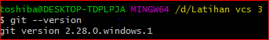
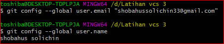

# Latihanvcs3

**Nama  :SHOBAHUS SOLICHIN**  

**NIM  :312010076**  

**KELAS :TI.20.A.1**  

## LANGKAH-Langkah Penggunaan Git

*Download git terlebih dahulu,dengan link berikut :[click Here](https://git-scm.com) 

*setelah file terdownload silahkan lakukan instalasi dengan 
referensi berikut ini : [Git installation guide](https://git-scm.com/book/en/v2/Getting-Started-Installing-Git) 

 

*setelah installasi selesai,buka**GitBash** pada 
menu di windows, dan lakukan pengecekan **versi**,dengan 
mengetik *syntax* berikut :  

`git --version`  

  

*jika muncul tampilan **git version**, berarti Git sudah
**berhasil di install** dan bisadi **gunakan** Langkah pertama
kirus **mengkonfirmasikan user name** dan **email di git**,
dengan mengetikan *syntax* berikut :  

`git commit --global user.name"masukan nama anda"`  

`git commit --global user.email "masukin email anda"`  

*buat akun di **GitHub**,seperti contoh dibawah ini. Dan lakukan verifikasi akun melalui 
email yang sudah terdaftar.

*jka akun **GitHub** sudah selesai dibuat dan di verifikasi, proses selanjutnya silahkan buat
Repository sseprti gambar dibawah ini :  
**penjelasan**

> * `Repository Name : (Silahkan isi nama repository yan diinginkan seperti contoh saya ingin
membuat repository Latihanvcs3)` 

> * `Description : (Isi dengan deskripsi atau penjelasan tentang repository Anda)`

> * `Public / Private : (Pilih salah satu jenis repository akan bisa dilihan sama semua orang atau tidak)`  

> * `Add a README.md file : Centang pada bagian ini jika Anda menginginkan file README.md ada di repository Anda`  

> * `Add .gitignore : Merupakan sebuah file yang berisi daftar nama-nama file dan direktori yang akan diabaikan oleh Git.`  

> * `Choose a license : Silahkan centang jika Anda memiliki lisensi pada repository yang akan dibuat Kemudian tekan tombol Create Repository untuk menyimpan`  

