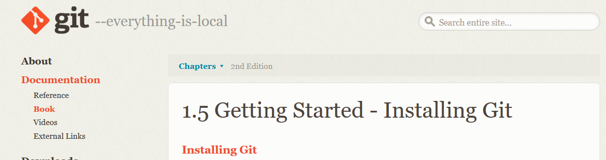

# Latihanvcs3

**Nama  :SHOBAHUS SOLICHIN**  

**NIM  :312010076**  

**KELAS :TI.20.A.1**  

## LANGKAH-Langkah Penggunaan Git

*Download git terlebih dahulu,dengan link berikut :[click Here](https://git-scm.com) 

*setelah file terdownload silahkan lakukan instalasi dengan 
referensi berikut ini : [Git installation guide](https://git-scm.com/book/en/v2/Getting-Started-Installing-Git) 

 

*setelah installasi selesai,buka**GitBash** pada 
menu di windows, dan lakukan pengecekan **versi**,dengan 
mengetik *syntax* berikut :  

'git --version'  

  

*jika muncul tampilan **git version**, berarti Git sudah
**berhasil di install** dan bisadi **gunakan** Langkah pertama
kirus **mengkonfirmasikan user name** dan **email di git**,
dengan mengetikan *syntax* berikut :  

'git commit --global user.name"masukan nama anda"'  

'git commit --global user.email "masukin email anda"'  

asall

